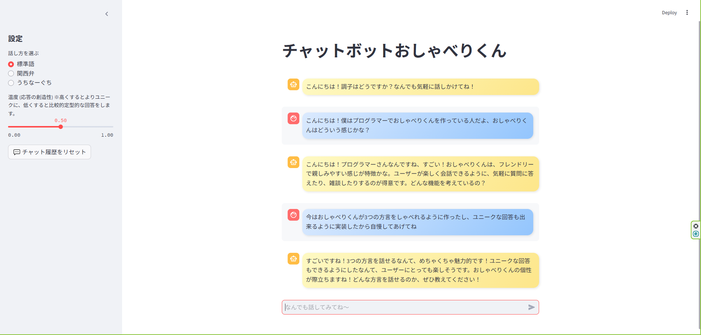
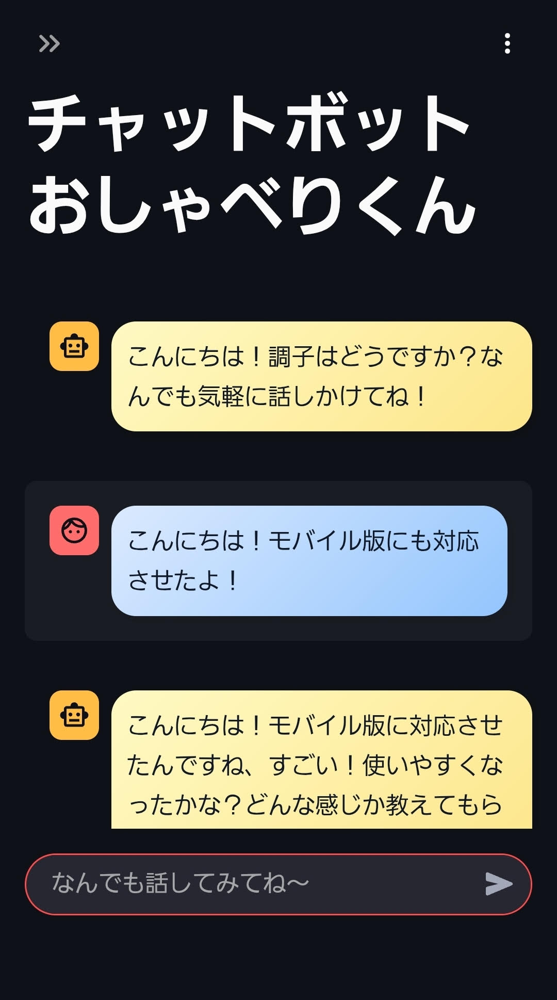

# チャットボット「おしゃべりくん」

## 概要
Azure OpenAI API と Streamlit を使って作成した、3種の日本語で会話できるチャットボットです。  
過去の会話履歴を保持しながら、フレンドリーに応答します。  
サイドバーから温度パラメータ（temperature）の調整や履歴リセットが可能です。

---

## 技術選定理由
本プロジェクトではフレームワークとして Streamlit を採用しました。学習の中で初めて触れた際、Pythonのシンプルなコードだけで他のフレームワークよりも容易にUIを構築できる点が印象的で、「これなら自分でもすぐに動くアプリを作れる」と感じたことがきっかけです。その体験を基に、学んだ内容を実際のポートフォリオに活かしたいと考え、本プロジェクトの作成に至りました。特にリアルタイムなチャット画面のように通常であればフロントエンドや非同期処理を考慮する必要のある機能を、短いコードで実現できる点は大きな魅力です。また、サイドバーやチャットUIといった便利な部品が標準で揃っているため、見た目を整える手間を減らしつつ機能開発に集中できることも、採用の決め手となりました。

---

## 主な機能
- 💬 標準語/関西弁/うちなーぐち（琉球方言）での応答
- 🔄 会話履歴の保持（`st.session_state` を使用）
- 🎛 Temperature 調整スライダー
- 🗑 2段階確認付き履歴リセット
- 🌐 Azure OpenAI API 連携

---

## 必要環境
- Python 3.9 以上
- Azure OpenAI API の利用権限
- Streamlit インストール環境

---

## インストール手順

```bash
# リポジトリのクローン
(任意の書き込み可能なディレクトリに移動してgit clone以下のコマンドを実行してください)
例: cd C:\Users\<ユーザー名>\Documents または cd C:\Users\<ユーザー名>\OneDrive\デスクトップ (OneDrive使用時)

※PowerShellでホームディレクトリに移動する場合: cd ~

git clone https://github.com/Saku-Uezt/chatbot_oshaberi_kun.git
cd chatbot_oshaberi_kun

# 仮想環境作成（任意）
python -m venv .venv

#仮想環境のアクティベート(仮想環境を作成した場合に実行)
※Windowsの場合
cmd.exe（コマンドプロンプト）またはVSCodeの統合ターミナルで、以下を実行してください：
.\.venv\Scripts\activate.bat

注意：PowerShellで実行する場合は、事前に
Set-ExecutionPolicy -Scope Process RemoteSigned
を実行する必要があります。

※Macの場合
source .venv/bin/activate

（仮想環境から抜けるには）
deactivate

# 必要パッケージのインストール
pip install -r requirements.txt


# 環境変数設定

ルートディレクトリに .env ファイルを作成し、以下を記載してください。

ENDPOINT_URL=あなたのAzureエンドポイントURL
DEPLOYMENT_NAME=デプロイ名
AZURE_OPENAI_API_KEY=あなたのAPIキー


# 実行方法
streamlit run oshaberi_kun.py
```
---

## 更新情報（v2.1.0）
-  標準語/関西弁/うちなーぐち（琉球方言）の切り替え機能を実装しました
-  会話履歴リセットボタン押下時に発生するバグ修正を実装しました
-  Azure OpenAIのコンテンツフィルター例外処理を実装しました
-  botからのレスポンス時に段落が下がってしまう不具合を修正しました
---

## 今後の改善予定
-  細かなレイアウト修正
-  その他のエラーに関する例外処理の実装
-  モバイルブラウザ上でのレイアウト対応
---

## UIイメージ（ブラウザ/モバイル）
<p align="center">
  
  
</p>


## ライセンス
このプロジェクトは MIT ライセンスのもとで公開されています。
